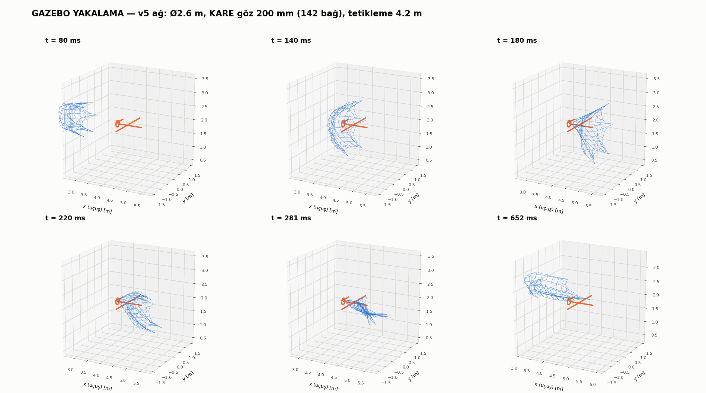

# Ağ Fırlatma Mekanizması — Tasarım, Modelleme ve Doğrulama

Tail-sitter VTOL dronun altına monte edilen, **lastik bant tahrikli ağ
fırlatıcı**. Hedef: **X-UAV Talon** (1718 mm kanat açıklığı). İki araç da
**100 km/h** ile uçuyor.

**Öldürücü mekanizma pervaneye ip dolanmasıdır** — bilyeler ikincil
(12 g, 20 m/s'de 2.4 J: köpüğe çukur açar, yapı kırmaz). Tek bir ipin
pervaneye değmesi motoru durdurmaya yeter; bu, ağın göz açıklığını
belirleyen temel kriterdir.

> ⚠️ **Durum: üretime hazır, HENÜZ TEST EDİLMEDİ.** Modelin
> cevaplayamadığı üç soru var (§6) — yer testleri yapılmadan uçuşa
> geçilmemeli.

---

## 1. Nasıl geliştirildi — yöntem

**İki katmanlı modelleme.** Ucuz bir indirgenmiş model (ROM) ile tasarım
uzayı taranıyor, pahalı tam 3B model ile doğrulanıyor.
**ROM defalarca YANLIŞ tasarım kararı üretti** — "yay uygulanamaz",
"helisel yiv gereksiz" gibi sonuçların hepsi ROM artefaktıydı ve ancak tam
model + Monte Carlo ile yakalandı (§5).

**SciPy ile tasarım uzayı keşfi.** Sobol dizisiyle örnekleme,
`differential_evolution` ile optimizasyon, Spearman sıra korelasyonuyla
duyarlılık analizi.

**Ağ modeli.** Yığınsal parametre (lumped-parameter) yaklaşımı: ağ
düğümlere yığınlaştırılıyor, iplikler **yalnızca ÇEKME taşıyan**
viskoelastik elemanlar — basma kuvveti taşımıyorlar (tek taraflı kısıt).
Bu, uzay enkazı yakalama literatürünün standardı. Her elemana
**normal/teğet ayrışımlı silindir sürüklemesi** uygulanıyor
(Cd_n ≈ 1.1, Cd_t ≈ 0.03). Entegrasyon: velocity-Verlet, CFL zaman adımı.

**Parametrik CAD.** FreeCAD 0.19 headless (`freecadcmd`), OpenCascade
boolean işlemleri. Tüm geometri `v4_konfig.json`'dan türetiliyor.

**Gazebo Harmonic (gz-sim 8) + DART, ÖZEL C++ system plugin.**
Gazebo'nun kendi sürükleme eklentileri ipliği modelleyemiyor; iplik
gerilmesi ve aerodinamik `AgFizik.cc` içinde hesaplanıp `AddWorldForce`
ile uygulanıyor.

**HİBRİT DEVİR.** Ağın paketten açılması rijit-cisim temas problemi
değildir: paketli halde 709 çarpışma küresi 16 mm'lik hazneye tıkılıdır ve
DART'ın LCP çözücüsü yüz binlerce temas kısıtıyla çöker. Çözüm:
*paketten açılma* doğrulanmış Python modelinde, *temas ve yakalama*
Gazebo'da — ağ **t = 80 ms**'de açık halde devralınıyor.

**Tedarik araştırması.** Paralel web ajanlarıyla; her link açılıp sayfa
içeriğinden doğrulandı, doğrulanamayan link verilmedi (`TEDARIK_PLANI.md`).

### Kullanılan araçlar
`Python 3` · `NumPy` · `SciPy` · `matplotlib` · `FreeCAD 0.19` ·
`Gazebo Harmonic (gz-sim 8)` · `DART` · `C++17` · `gz-plugin2` · `CMake`

---

## 2. Doğrulama — projenin güven temeli

Python (kendi yazdığım velocity-Verlet entegratörü) ve Gazebo (DART)
**bağımsız iki çözücü** olarak aynı fiziği çözüyor:

| | Python | Gazebo | sapma |
|---|---|---|---|
| R_tepe | 1.126 m | 1.120 m | **−0.5 %** |
| zirve zamanı | 192 ms | 192 ms | **−0.2 %** |
| atış penceresi | 3.54 – 6.08 m | 3.54 – 6.04 m | **4 cm** |

Gerçek altıgen örgüde, devir sonrası serbest uçuşta sapma **%0.23**.

**Bağımsız bir teyit daha:** ürettiğim örgü **83.2 m** iplik veriyor,
`params.py`'daki analitik formül (`2A/göz + 6R`) **81.1 m** — **%2.5**
uyum. İki ayrı yoldan hesaplanan büyüklükler örtüşüyor.

---

## 3. Sonuçlar

```
çıkış hızı        : 31.1 m/s
açılma            : 200 ms'de R = 1.13 m      (gereken 0.859 m — Talon yarı açıklığı)
geometrik pencere : 3.56 – 6.54 m
EN İYİ TETİKLEME  : 4.0 – 4.5 m               (§5 — Gazebo bunu tersine çevirdi)
ip tepe yükü      : 19 N                      (kopan eleman: 0)
sistem kütlesi    : ~390 g
ağ                : Ø2.6 m altıgen dış hat, KARE göz 200 mm,
                    142 bağ, ~2.5 saat el emeği
```



### Tasarım tablosu

| | Değer |
|---|---|
| Namlu | Ø52 × **149.8 mm**, DÜZ delik (yiv yok), arkası açık (yükleme ağzı) |
| Tahrik | **4 × Ø15.2/4 mm saf lateks tüp**, **30.3 mm** kauçuk boyu, ×4.0 kurulu |
| Bant bağlantısı | ağız bileziği kulakları (±Z) → kapsüldeki **Ø8 civa çeliği** çapraz pim (düz yarıklardan çıkar) |
| Yuva koni açısı | **13°** |
| Bilye / ağ | Ø12.7 **kurşun** × 6 / **Ø2.6 m, KARE göz 200 mm** + çevre halatı, Dyneema **örgü** Ø0.165 |
| Strok | **91 mm** |
| v_çıkış | **31.1 m/s** |
| Atış penceresi | **3.56 – 6.54 m** geometrik · **EN İYİ 4.0–4.5 m** (bkz. §5) |
| Kütle | **~390 g** (servolar + ağ + bilyeler dahil) — MG996R ile 492 g idi |
| Tetik | 2 karşılıklı pim, kapaklı kartuş + geri-getirme yayı; **PTFE burç ŞART**; 2 × **MİKRO** metal dişli servo (~14 g), makara r=2.2 mm |

Yaylı tasarım `cad/eski_tasarimlar/yay_tahrikli/` altında arşivlendi (kısa namluda
blok boyu stroku yiyor, kurma kuvveti 1000 N'u aşıyordu).

Bant doğrulaması: tek banda bagaj kantarıyla ×3.0'da ~184 N, ×3.5'te ~217 N
beklenir (`agsim/lastik.py: cekme_testi_tablosu`). Ölçüm farklıysa `Gmod`'u
aynı oranda düzeltin.


---

## 4. Temel fizik

**Balistik uzunluk** λ = 2m/(ρ·Cd·A) — ağ menzilini belirleyen tek baskın
parametre. Kapalı form erişilebilir menzil:

```
Δx_max = λ·[ln(v₀/V) − 1 + V/v₀],     v₀ = V + v_namlu
```

**Ağı durduran sürüklemedir, gerilme değil.** Tepe iplik gerilmesi
serbest uçuşta 2–4 N, kopma yükü 64 N. Ağ gergin hale gelip durmuyor;
hava onu yavaşlatıyor.

**Ağ neden açıldıktan sonra kapanıyor?** Bilyeler radyal hızla dışa
açılıyor, ağ gerilince elastik olarak geri çekiyor; hava bu salınımı
sönümlüyor. İplik sönümlemesinin (ζ = 0.05…0.90) etkisi **sıfır** —
sönümleme tamamen aerodinamik.

**Ağır bilye hafif ağı çekiyor.** Bilye λ ≈ 234 m, ağ λ ≈ 0.24 m.

**Pervane yakalama kriteri.** Kenarı `a` olan kare hücreye sığan en büyük
çember `a√2`. Eskiden "diskte bir DÜĞÜM bulunsun" diyordum (göz < 163 mm);
tek ip motoru durdurmaya yettiği için gerçek kriter "diski en az bir İP
kessin" → **göz < 230 mm**. Göz 200 mm seçildi (%13 pay).
Gazebo ölçümü: ağ uçağın üzerinden süpürülürken diskten **32 farklı
iplik** geçiyor.

---

## 5. Yol boyunca düzeltilen hatalar

> Bu bölüm projenin en değerli kısmı. "Şunu yaptık, çalıştı" tarzı bir
> anlatım bu projeyi anlatmaz — doğru sonuçların çoğuna yanlış sonuçları
> yakalayarak varıldı.

### Fizik / model
- **Hava sürüklemesinin etkisini küçümsemiştim.** Kullanıcı itiraz etti,
  kontrol ettim: **HAKLIYDI.** Menzil vakumda 61.6 m, sürüklemeyle 4.0 m.
  Yaptığım karşılaştırma zaten ikisi de sürükleme-baskın iki durumu
  kıyaslıyordu, bu yüzden etki küçük görünüyordu.
- **"Helisel yiv gereksiz" bulgusu YANLIŞTI.** Enerjisi yetersiz yay ve
  yanlış amaç fonksiyonundan geliyordu; Pareto cephesinde 9 tasarımın
  8'i helisel yiv kullanıyordu.
- **"Yay uygulanamaz" sonucu ROM artefaktıydı.** Tam model Monte
  Carlo'da %93–98 yakalama verdi.
- **Amaç fonksiyonu yanlıştı** (R_eff). `differential_evolution`
  11.27 m'lik sahte bir optimum buldu; Monte Carlo o tasarımda **%0**
  yakalama verdi. Amaç fonksiyonu "angajman anındaki kapsama"ya çevrildi.
- **netfull'de sürükleme gerçek ağa ölçeklenmiyordu.** Kütle
  ölçekleniyordu ama sürükleme ölçeklenmiyordu → ağ sürüklemesi **~2.5×
  düşük** hesaplanıyordu. Bu düzeltmeden önceki tüm sayılar iyimserdi.
- **Kare-göz iplik formülü altıgen ağa uygulanmıştı.**

### Topoloji — en büyük düzeltme zinciri
- **Tasarım taraması "örümcek ağı" topolojisiyle yapılmıştı.** Gerçek
  altıgen örgü **%6.7 daha geniş** açılıyor. Sebep topolojik: örümcek
  ağındaki sürekli çevrel halkalar çember gerilmesiyle açılmaya direniyor,
  bal peteğinde sürekli halka yok.
- **ÇEVRE HALATI modellenmemişti** — malzeme listesinde (F2) vardı ama
  simülasyona girmemişti. Onsuz kare ağın köşeleri desteksiz kalıyor ve
  açılamıyordu; bu yüzden kare gözü yanlış değerlendirdim.
- **Düğüm sayısını 709 sandım; gerçek 315.** Malzeme listesindeki 259
  (göz kesişimi) doğruymuş. Kendi kurduğum altıgen kafesin düğümünü sayıp
  listeyi "düzeltmiştim".

### Operasyonel — Gazebo'nun tersine çevirdiği tavsiye
**"Pencerenin uzak yarısından ateşle, ip yükü düşük olur" demiştim. YANLIŞ.**

Python modeli yalnızca *"ağ yeterince açık mı"* diye bakıyor;
*yakalayıp yakalamadığına* bakmıyor. Gazebo'nun temas simülasyonu uzakta
ağın uçağın üzerinden **değip geçtiğini** gösterdi:

| tetikleme | ağın uçağa serilme oranı | aktarılan momentum |
|---|---|---|
| 3.6 m | %78 | 2.08 kg·m/s |
| **4.2 m** | %52 | 1.64 kg·m/s |
| 5.0 m | %28 | 0.64 kg·m/s |
| 7.0 m | **%24** | 0.37 kg·m/s |

**DOĞRUSU: 4.0 – 4.5 m'den ateşle.**

### Gazebo / yazılım
- **`WorldPoseCmd` kaldırma zamanlaması.** Kinematik taşımayı eklerken poz
  komutunu atıştan bir adım sonra kaldırıyordum; ateşleme adımında poz komutu
  ile hız komutu çakışıp **sahte gerilme sıçraması** yarattı (16 → 31 N).
  Entegrasyon testinde yakalandı; komut artık ateşleme adımında, hızlar
  verilmeden önce kaldırılıyor.
- **`SetLinearVelocity` kalıcı bir KİNEMATİK KISIT bırakıyor.**
  `LinearVelocityCmd` bileşeni her adımda yeniden uygulanıyor → gövdeler
  o hıza kilitleniyor ve hiçbir kuvvete tepki vermiyor. Serbest düşme
  testiyle kanıtlandı (hız −0.006 m/s'de sabit kaldı, −2.0 olmalıydı).
  Atıştan bir adım sonra komut kaldırılarak düzeltildi.
- **dt kararlı sınırın 4 katıydı** (0.5 ms, sınır 0.12 ms) → sayısal
  patlama, ODE AABB taşması. Artık dt iplik periyodundan otomatik
  türetiliyor.
- **Kuvvet tavanı 5 N çarpma anında 10486 kez devreye girip fiziği
  bozuyordu.** 200 N'a çekildi (yalnızca NaN koruması); yerine iplik
  kopma sayacı eklendi.
- **SDF üreticisinde tanımsız sabit** (`PERVANE`) → üretim sessizce
  çöktü ve **4 Gazebo koşusu ESKİ dünya dosyasını** simüle etti.
  Dördünün de birebir aynı sayıyı vermesi fark ettirdi. Üretici hatası
  artık koşuyu durduruyor.
- **Hazne hacmi eski Python değerinden alınmıştı** (20.5 cm³);
  CAD'deki gerçek değer **17.3 cm³**.

### CAD
- v1'de durdurma omzu bilyeleri engelliyordu (omuz iç çapı 18.7 mm,
  bilye dış kenarı 19.9 mm).
- Kama/oluk profilinin eksenleri ters girilmişti (radyal ↔ çevrel).
- Pim kapsüle teğetti → geçersiz katı; profil 0.8 mm gömüldü.
- **Tetik tek geçme çubuktu.** Kullanıcı asimetrik çekiş itirazı yaptı:
  **HAKLIYDI.** İki ayrı pime bölündü.


### Namlu kısaltma — menzil beklenenden az etkilendi
Namlu 180.5 → **149.8 mm**'ye indirildi (strok 114 → 91 mm).

| namlu | strok | enerji | v_çıkış | pencere |
|---|---|---|---|---|
| 180.5 mm | 114 mm | 78.2 J | 34.6 m/s | 3.58 – 6.80 m |
| **149.8 mm** | **91 mm** | **62.4 J** | **31.1 m/s** | **3.56 – 6.54 m** |
| 140 mm | 84 mm | 57.3 J | 29.9 m/s | 3.56 – 6.46 m |

Çıkış hızından **%10** verildi ama pencerenin uzak kenarı sadece **26 cm**
kısaldı. Sebep §4'teki balistik uzunluk: ağı durduran sürüklemedir ve
`Δx ∝ λ·[ln(v₀/V) − 1 + V/v₀]` — **logaritmik**, hıza doymuş davranır.
Kazanç: namlu −31 mm, **−20 g**, filament 210 → 190 g.
Kurma kuvveti **değişmedi** (30.6 kg/bant) çünkü λ=4.0 korundu; sadece
bant daha kısa kesiliyor (38 → 30.3 mm).

Gazebo ile doğrulandı (tetikleme 4.2 m): tepe iplik yükü **16.4 N**,
kopan eleman **0**, pervaneden geçen **14 iplik**, ağın uçağa serilme
oranı **%47**, aktarılan momentum **1.30 kg·m/s**. Yakalama 180 mm'ye
göre bir miktar zayıfladı (53 → 14 iplik, momentum 1.64 → 1.30) ama
"tek ip yeter" kriterinin **14 katı** üzerinde.

### Tedarik — araştırmanın değiştirdiği tasarım kararları
- **7075-T6 Ø8 Türkiye'de SATILMIYOR** (çekme 7075 Ø13'ten başlıyor).
  Mukavemet hesabı yapıldı: tasarım gerilmesi **202 MPa**.

  | malzeme | SF | karar |
  |---|---|---|
  | 7075-T6 *(hedef)* | 2.4× | TR'de yok |
  | **civa çeliği 1.2210** | **2.2×** | ✅ seçildi |
  | 6061-T6 | 1.4× | sınırda |
  | 6063 | **0.84×** | ❌ kırılır |
  | 304 paslanmaz | **1.04×** | ❌ yetersiz |

  Bedeli: +23 g (sistem 469 → 492 g).
- **TR'deki MG996R'lerin hepsi "half metal"** (iç dişliler plastik).
  Pahalı servo almak yerine makara küçültüldü — ama asıl düzeltme aşağıda.
- **MG996R çok ağırdı (110 g = sistemin %22'si).** Servo seçimini
  **iş korunumunu** gözden kaçırarak yapmıştım: `tork × açı = F_pim × strok`
  sabittir ve r=4 mm makara servonun dönüş aralığının yalnızca **86°**'sini
  kullanıyordu. Makara r=2.2 mm + kanal derinliği 5→4 mm ile **130°**
  kullanılıyor, gereken tork **3.9 → 2.15 kg·cm**'ye düşüyor.
  Sonuç: 2 × MG996R (110 g) yerine 2 × mikro metal dişli servo (28 g),
  **1.81× pay** ve **−82 g**. Namlunun servo yatağı zaten M2/mikro servo
  için tasarlanmıştı; sadece delik aralığı 18 → 28 mm'ye düzeltildi (oval,
  marka farkını tolere etsin diye).


### Üç ayrı yerde kullanıcının fiziksel sezgisi analizi yendi
1. **Sürükleme büyüklüğü** — "bu etki çok daha fazla olmalı" dedi, haklıydı.
2. **Tek pim asimetrisi** — "kapsül pimin çekildiği tarafa kayar" dedi,
   haklıydı; tasarım iki pime bölündü.
3. **Ağın gereğinden karmaşık olması** — "bu kadar ipe ve düğüme gerek yok,
   tek ip pervaneye yeter" dedi. Doğrulandı: bağ 811 → 142, iplik
   100 → 53 m, üstelik **pencere uzadı ve yakalama iyileşti**.

---

## 6. Modelin cevaplayamadıkları

Dürüst olmak gerekirse üç soru açık. Üçü de yer testiyle çözülecek.

**1. AĞIN DOLANMASI — en kritik belirsizlik.**
İpin ipe takılması rijit-cisim + LCP çözücüsüyle modellenemez; ip/kumaş
çözücüsü (Cosserat çubuk veya konum-tabanlı dinamik) gerekir. Ağ paketten
temiz açılacak mı, bunu **yalnızca yer testi** söyler (240 fps çekim,
`URETIM_MONTAJ_REHBERI.md` §T3). Üç temiz açılma görülmeden uçuşa
geçilmemeli.

**2. PERVANENİN İPİ KESME EŞİĞİ.**
Eğilim biliniyor (temas basıncı ∝ 1/d), **mutlak eşik bilinmiyor**.
Kullandığım enine dayanım verisi gerçek kesilme kriterini yakalamıyor.
Tezgâh testi gerekiyor (§T5): ipi kanada sar, ~15 N ger, motoru çalıştır.

**3. DÜĞÜM VERİMİ.**
%55 literatür tahmini (UHMWPE aralığı %50–60). Gerçek düğümlü numuneyle
çekme testi yapılmalı. *(Yükler düşük olduğu için belirleyici değil —
hiçbir eleman kapasitenin yarısına ulaşmıyor.)*

**Ayrıca: TARET TASARIMI henüz yapılmadı** (kullanıcı isteğiyle ertelendi).
Şimdilik sabit bir yatak yeterli.

---

## 7. Dosya haritası

```
baski/                  ★ 3D BASKI — doğrudan slicer'a at
                          8 × STL (BASKI YÖNÜNDE hazır, tablaya oturtulmuş,
                          döndürme gerekmez) + 8 × STEP + BASKI_AYARLARI.md
baski.zip                 aynısının zip'i

ALISVERIS.md            ★ ALIŞVERİŞE GİDERKEN BUNU AL — tek dosya,
                          siparişe göre gruplu, 42 kutucuk
URETIM_MONTAJ_REHBERI.md  üretim + montaj, 14 bölüm (güvenlik, baskı,
                          ağ örme, bant, montaj, kurma, testler)
malzeme_listesi.md        teknik özellikler, her parçanın nereye gittiği
TEDARIK_PLANI.md          doğrulanmış satın alma linkleri
SATIN_ALMA_LISTESI.md     kategori bazlı alışveriş rehberi
TORNA_IS_EMRI.png         tornacıya götürülecek ölçülü teknik resim

agsim/                    fizik modeli
  params.py                 parametreler, malzeme veritabanı
  netfull.py              ★ tam 3B ağ modeli (karar veren model)
  hexag.py                ★ gerçek örgü üreteci (altıgen + kare + çevre halatı)
  lastik.py               ★ lateks bant modeli (neo-Hooke)
  kesilme.py              ★ pervane kesme analizi (Smith, bükülme, düğüm)
  aero.py                   sürükleme
  netrom.py, dse.py, ...    ROM ve tarama altyapısı (arşiv)

cad/
  lastik_montaj_v4.py     ★ parametrik tam montaj (v4_konfig.json'dan)
  baski_parcalari.py      ★ baskı parçalarını üretir → baski/
  ciz_torna_resmi.py        torna iş emri çizimi
  eski_tasarimlar/          arşiv (.py kaynaklar; .step'ler üretilebilir)

gazebo/
  models/ag_firlatici/    ★ MONTE EDİLEBİLİR MODEL PAKETİ (bkz. §9)
                            model.config + model.sdf + meshes/
                            4 link, 389 g, montaj çerçeveleri
  plugin/AgFizik.cc       ★ özel C++ system plugin (ağ fiziği + tetik topic'i)
  scripts/ag_sdf_uret.py  ★ dünya üreteci
  scripts/model_paketi_uret.py  model paketini üretir
  scripts/karsilastir.py    Gazebo ↔ Python doğrulaması
  scripts/ciz_yakalama.py   3B yakalama görselleştirmesi
  kos.sh                    koşu betiği

out/                      grafikler, sonuç belgeleri, konfigürasyonlar
  GAZEBO_sonuc.md           Gazebo entegrasyonu sonuçları
  AG_v5_SADELESTIRME.md     ağ sadeleştirme kararı
  IP_CAPI_KARAR.md          iplik çapı kararı
arsiv_analizler/          süperseded analizler (OKUBENI.txt uyarısıyla)
```

**Nereden başlamalı:** üretecekseniz `ALISVERIS.md` → `baski/` →
`URETIM_MONTAJ_REHBERI.md`. Modeli anlamak istiyorsanız §5 (hatalar) →
`agsim/netfull.py` → `out/GAZEBO_sonuc.md`.
**Kendi dronuna entegre edecekseniz doğrudan §9.**

---

## 8. Nasıl çalıştırılır

```bash
# --- Python analizleri ---
python3 run_menzil_nihai.py        # menzil, atış penceresi, Monte Carlo
python3 run_ip_incelt.py           # iplik çapı taraması
python3 ciz_ag_2b.py               # ağ topolojisi karşılaştırma çizimi

# --- CAD ---
freecadcmd cad/lastik_montaj_v4.py # tam montaj → cad/V4_*.step
freecadcmd cad/baski_parcalari.py  # baskı parçaları → baski/ (STL + STEP)

# --- Gazebo plugin derleme ---
cd gazebo/plugin && mkdir -p build && cd build
cmake .. -DCMAKE_BUILD_TYPE=Release && make -j4

# --- Simülasyon ---
./gazebo/kos.sh dogrulama          # hızlı, hedefsiz, Python ile karşılaştırma
AG_ORGU=kare ./gazebo/kos.sh yakalama       # gerçek örgü + hedef
AG_ORGU=kare ./gazebo/kos.sh yakalama gui   # üstüne GUI

python3 gazebo/scripts/karsilastir.py       # Gazebo ↔ Python doğrulaması

# --- Monte edilebilir model paketi + harici tetikle atış (bkz. §9) ---
python3 gazebo/scripts/model_paketi_uret.py        # gazebo/models/ag_firlatici/
export GZ_SIM_RESOURCE_PATH=$PWD/gazebo/models
AG_FIRLATICI=1 AG_TETIK=harici AG_ORGU=kare AG_RAG=1.3 AG_GOZ=0.20 \
  python3 gazebo/scripts/ag_sdf_uret.py
gz sim -r gazebo/worlds/ag_atis.sdf &
gz topic -t /ag_firlatici/ates -m gz.msgs.Boolean -p "data: true"
```

### Ortam değişkenleri

| Değişken | Varsayılan | Ne yapar |
|---|---|---|
| `AG_ORGU` | `orumcek` | örgü tipi: `orumcek` \| `hex` \| `kare` |
| `AG_RAG` | config | ağ köşe yarıçapı [m] |
| `AG_GOZ` | config | göz açıklığı [m] |
| `AG_DIP` | config | iplik çapı [m] |
| `AG_MENZIL` | `4.65` | hedefin atış anındaki mesafesi [m] |
| `AG_CARPISMA` | `1` | `0` = çarpışma/hedef yok (hızlı doğrulama) |
| `AG_DEVIR` | hex/kare için `0.08` | hibrit devir anı [s]; `0` = kapsülden fırlat |
| `AG_SURE` | `0.75` | simüle edilecek sim-zamanı [s] |

### Gereksinimler
```
Python 3.8+ · numpy · scipy · matplotlib
FreeCAD 0.19+          (freecadcmd)
Gazebo Harmonic        (gz-sim 8) + gz-physics (DART)
gz-cmake3, gz-plugin2, gz-math7, gz-common5, sdformat14, CMake 3.16+
```

---

## 9. Başka bir araca entegrasyon

> Bu bölüm, fırlatıcıyı **kendi drone modeline** eklemek isteyenler için.
> `gazebo/worlds/ag_atis.sdf` bir **test dünyasıdır**, monte edilebilir model
> değildir — onu kullanma. Monte edilecek paket: `gazebo/models/ag_firlatici/`

### 9.1 Model paketi

```
gazebo/models/ag_firlatici/
  model.config          paket tanımı, kütle dağılımı, açıklama
  model.sdf             4 link + 3 eklem + 2 montaj çerçevesi
  meshes/namlu.stl      görsel (çarpışma = silindir, daha hızlı)
  meshes/kapsul.stl
```

**Eksen düzeni:** `+X` namlu ekseni (ağız yönü), `+Z` yukarı.
**Orijin:** namlunun **arka yüzünün merkezi** (yükleme ağzı).

| link | kütle | içerik |
|---|---|---|
| `namlu` | **216.2 g** | gövde + 4 lateks bant + tetik donanımı + kablolar |
| `kapsul` | **138.0 g** | kapsül + çapraz pim + **ağ + 6 kurşun bilye** |
| `servo_sag` / `servo_sol` | **14.3 g** ×2 | mikro metal dişli servo |
| **TOPLAM** | **389.4 g** | |

`kapsul` link'i `namlu`ya **prizmatik eklemle** bağlı (eksen +X, strok 0–91 mm).
Servolar sabit eklemle. Atalet tensörleri gerçek geometriden hesaplandı
(içi boş silindir / kutu).

İki montaj çerçevesi var:
- **`montaj`** — namlu ortası, üst yüzey. Kendi gövdene bağlarken bunu referans al.
- **`agiz`** — namlu ucu. **Tetikleme mesafesi buradan ölçülür.**

### 9.2 Kendi dünyana ekleme — kopyala-yapıştır

```bash
export GZ_SIM_RESOURCE_PATH=$GZ_SIM_RESOURCE_PATH:/yol/ag_firlatma/gazebo/models
```

```xml
<model name="benim_dronum">
  <link name="govde"> ... </link>

  <!-- FIRLATICIYI EKLE -->
  <include>
    <uri>model://ag_firlatici</uri>
    <name>firlatici</name>
    <!-- gövdenin 8 cm altına, burun yönünde -->
    <pose relative_to="govde">0.10 0 -0.08 0 0 0</pose>
  </include>

  <!-- TEK EKLEMLE SABITLE -->
  <joint name="firlatici_baglanti" type="fixed">
    <parent>govde</parent>
    <child>firlatici::namlu</child>
  </joint>
</model>
```

Tail-sitter'da namlu **ileri-aşağı** bakmalı; `<pose>`'un son üç değeriyle
(roll pitch yaw) eğ.

### 9.3 Ağ fiziği — model paketinde DEĞİLDİR

Ağ düğümleri **ayrı `<model>`'ler** olarak üretilir ve dünya seviyesindeki
`AgFizik` plugin'i ile çözülür. Bu kasıtlı — §9.6'daki ilk maddeye bak.

```bash
# plugin derle
cd gazebo/plugin && mkdir -p build && cd build
cmake .. -DCMAKE_BUILD_TYPE=Release && make -j4
export GZ_SIM_SYSTEM_PLUGIN_PATH=/yol/ag_firlatma/gazebo/plugin/build

# ag + plugin blogunu uret (kendi dunyana kopyalayacagin parca)
AG_FIRLATICI=1 AG_TETIK=harici AG_ORGU=kare AG_RAG=1.3 AG_GOZ=0.20 \
  python3 gazebo/scripts/ag_sdf_uret.py
```

Üretilen `gazebo/worlds/ag_atis.sdf` içinden **ağ düğümleri + `<plugin>`
bloğunu** kendi dünyana kopyala. Plugin'de şu iki alanı kendi modeline göre
ayarla:

```xml
<plugin filename="AgFizik" name="ag::AgFizik">
  <firlatici_link>namlu</firlatici_link>      <!-- taşıyıcı link adı -->
  <tetik_konu>/ag_firlatici/ates</tetik_konu>
  <firlatma_t>-1</firlatma_t>                 <!-- -1 = yalnızca harici tetik -->
  ...
</plugin>
```

`<firlatici_link>` verilince plugin:
- atıştan **önce** ağ düğümlerini o linke **kinematik olarak taşır**
  (drone uçarken ağ onunla gider),
- atış anında hızları linkin **o anki yönelimine** göre uygular ve
  **linkin kendi hızını ekler**.

### 9.4 Ateşleme

```bash
gz topic -t /ag_firlatici/ates -m gz.msgs.Boolean -p "data: true"
```

Kendi kontrolcünden `gz-transport` ile de yayınlayabilirsin:

```cpp
gz::transport::Node node;
auto pub = node.Advertise<gz::msgs::Boolean>("/ag_firlatici/ates");
gz::msgs::Boolean m; m.set_data(true); pub.Publish(m);
```

### 9.5 Ortam değişkenleri

| Değişken | Varsayılan | Ne yapar |
|---|---|---|
| `AG_FIRLATICI` | `0` | `1` = fırlatıcı modelini dünyaya ekle, ağı ağzında doğur |
| `AG_TETIK` | `zamanli` | `harici` = yalnızca topic ile ateşle |
| `AG_TETIK_KONU` | `/ag_firlatici/ates` | tetik topic adı |
| `AG_HEDEF` | `1` | `0` = Talon hedefini koyma |
| `AG_CARPISMA` | `1` | `0` = çarpışma geometrisi yok (hızlı doğrulama) |
| `AG_ORGU` | `orumcek` | `kare` (üretilecek tasarım) \| `hex` \| `orumcek` |
| `AG_RAG` / `AG_GOZ` / `AG_DIP` | config | ağ yarıçapı / göz açıklığı / iplik çapı [m] |
| `AG_MENZIL` | `4.65` | hedefin atış anındaki mesafesi [m] |
| `AG_DEVIR` | hex/kare: `0.08` | hibrit devir anı [s] — §9.6 |
| `AG_SURE` | `0.75` | simüle edilecek sim-zamanı [s] |

### 9.6 ⚠️ ENTEGRASYONDA DİKKAT — bunlar olmadan çalışmaz

**1. Her ağ düğümü AYRI `<model>` olmak ZORUNDA.**
Tek model içindeki eklemsiz linkleri gz-physics/DART **tek gövdeye kaynaklar**
ve hiçbiri hareket etmez. Bu yüzden ağ, fırlatıcı modelinin *içinde* değil,
dünya seviyesinde ayrı modeller olarak duruyor.

**2. Zaman adımı iplik periyodundan TÜRETİLMELİ.**
```
dt ≤ (1/15) · 2π·√(m_düğüm / k_eleman)
```
Sabit dt kullanırsan sayısal patlama ve **ODE AABB taşması** alırsın
(`aabbBound >= dMinIntExact` assertion). Üreteç bunu otomatik hesaplıyor;
mevcut tasarımda **34 µs**. `<max_step_size>`'ı elle büyütme.

**3. Paketten açılma rijit-cisim çözücüyle YAPILAMAZ → hibrit devir ZORUNLU.**
Paketli halde 709 çarpışma küresi 16 mm'lik hazneye tıkılıdır; DART'ın LCP
çözücüsü yüz binlerce temas kısıtıyla **çöker**. Bu yüzden paketten açılma
doğrulanmış Python modelinde yapılır, Gazebo ağı **t = 80 ms**'de açık halde
devralır (`AG_DEVIR`). `AG_DEVIR=0` yapma.

**4. Geri tepme ~2.3 kg·m/s.**
Ağ + bilyeler 74 g, çıkış 31.1 m/s. Kapsül namlu içinde kalır, yani dışarı
atılan momentum bu. 2 kg'lık bir drone için **~1.2 m/s** hız değişimi —
tail-sitter'da tek atış yapılıp inileceği için nişan kayması önemsiz, ama
uçuş kontrolcüsü bunu bir bozucu olarak görecek.

**5. Tetikleme mesafesi 4.0–4.5 m.**
Geometrik pencere 3.56–6.54 m ama **uzakta ağ uçağın üzerinden değip geçiyor**
(7.0 m'de ağın yalnızca %24'ü uçağa değiyor). Servo gecikmesi ~120 ms;
100 km/h'te bu 0.77 m, yani hedef **5.0 m**'deyken tetikle.

### 9.7 ⚠️ BİLİNEN TUZAKLAR — aynı hatalara düşme

**`SetLinearVelocity` KALICI KİNEMATİK KISIT bırakır.**
`LinearVelocityCmd` bileşeni fizik sistemi tarafından **her adımda yeniden
uygulanır** → gövde o hıza kilitlenir ve hiçbir kuvvete tepki vermez. Serbest
düşme testiyle yakaladık: hız −0.006 m/s'de sabit kaldı, −2.0 olmalıydı.
Aynısı **`WorldPoseCmd`** için de geçerli (kinematik taşımada kullanılıyor).
Kendi kodunda hız/poz komutu kullanırsan **sen de kaldırmalısın**.

> **Kaldırma ZAMANLAMASI da önemli.** `WorldPoseCmd`'yi atıştan *bir adım
> sonra* kaldırınca, ateşleme adımında poz komutu ile `SetLinearVelocity`
> **aynı adımda çakışıyor**: düğümler önce poza kilitleniyor, sonra serbest
> kalıyor ve ağ sahte bir gerilme sıçraması yaşıyor. Entegrasyon testinde
> ölçüldü: **tepe gerilme 16 → 31 N**. Poz komutu ateşleme adımında,
> hızlar verilmeden **önce** kaldırılmalı. Plugin artık böyle yapıyor.

**Ağın DOLANMASI modellenmiyor.**
İpin ipe takılması rijit-cisim + LCP ile çözülemez; ip/kumaş çözücüsü
(Cosserat çubuk veya konum-tabanlı dinamik) gerekir. Simülasyon ağın temiz
açıldığını **varsayar**. Bu projenin en kritik doğrulanmamış varsayımı;
yer testiyle çözülecek.

**Pervane SABİT DİSK.**
Dönerek ipi sarma modellenmiyor. Plugin yalnızca diskten **kaç iplik geçtiğini**
sayar (`n_perv_toplam`). Asıl kilitleme mekanizması olan sarılma simülasyonun
dışında.

**Çalışma koşulu doğrulandı:** gz-sim 8 (Harmonic), DART, gz-plugin2,
gz-math7, gz-common5, gz-transport13, gz-msgs10, sdformat14, CMake 3.16+.

---

## 10. Model sınırları

- Ağ–ağ ve ağ–hava etkileşiminde ipin ipe takılması **modellenmiyor** (§6).
- Pervane Gazebo'da **sabit disk**; dönerek sarma modellenmiyor.
- Lateks için neo-Hooke modeli; sürünme (creep) ve histerezis yaklaşık.
- Monte Carlo hücre başına tek koşu — temas kaotik, saçılma ±%30 ölçüldü.
- Nişan hassasiyeti bilinmiyor; ağ yarıçapı fazlası nişan payıdır
  (R_açık 1.14 m, gereken 0.859 m → **0.28 m** tolerans).
